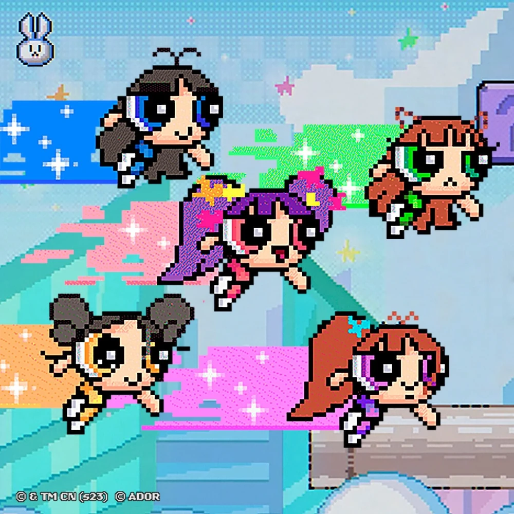
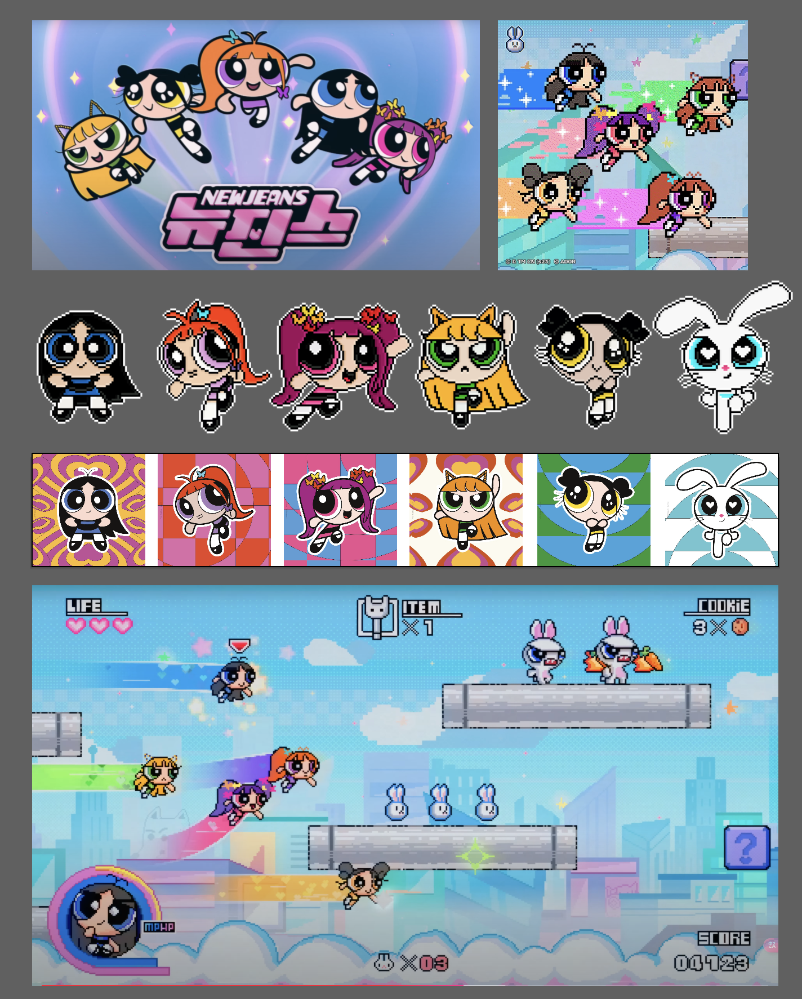

## Milestone 02
1. **Is your project split into different moments? or scenes?**
   My project based on the scenes, I have draw them, and want to make every layer into parallax scrolling.
2. **Which interactive events will you respond to? mouse? keyboard? time?**
   I want to use keyboard, make character move, and it will collide the bricks, the blood would decrease.
3. **Do you need any special files, arrays or objects?**
   Yes, I uploaded many png files, also considering whether to insert music from New Jeans.
4. **What are the custom functions that you’ll have to write?**
   I had written the character move function, and let it slightly move with sin, also with the collision code, but I haven't finished the game over page. Also I have make the parallax scrolling.
## Milestone 01 
1. **What book, album, or movie did you choose? What is it about?**  
   I chose the self-titled album from NewJeans.  
     
   The MV link: [linked text](https://www.youtube.com/watch?v=kcelgrGY1h8)  
   The reason I chose this album is due to its music videos. The producers didn't just focus on the idol group but aimed to convey their anti-patriarchal perspective in each video.  
   I chose this particular album because, in the song *New Jeans*, the team collaborated with *The Powerpuff Girls*. I love the aesthetic design of this collaboration. Moreover, the music video primarily focuses on animation, which inspired me to create a small interactive game.  
     
     
   The most impressive part is that it breaks the fourth wall by revealing the production behind the idol industry.  
     
     
   This is a bold move, as idol groups are often seen as dream-sellers, and most people try to hide the harsh reality of capitalism behind this industry. It not only showcases the hard work of the idols but also acknowledges the individuals who actually construct this industry. The producers behind the idol industry are like the laborers who built the skyscrapers in the 20th century—people remember the investors, not the ones who built it.

2. **What aspect of the book will you include in your cover?**  
   I will include this part:  
     
   It is interactive and game-like. I want to build an interactive page that contains some story chapters.

3. **Is it interactive? Time-based? Both?**  
   It is interactive, but if I have enough time, I would like to make it time-based as well. For example, the sky could change based on the time, and perhaps the gameplay could vary with added features like spotlights.

4. **What ideas would you like to explore or experiment with?**  
   I want to experiment with the 8-bit style and RPG games.

5. **Are there aspects of your project that are related to any of the readings we’ve done?**  
   I believe it relates to HW04, as it emphasizes enhancing the interactivity of the album instead of merely delivering a one-way narrative.

6. **Include at least one drawing or sketch**  
   I have already researched some design assets:  
   
